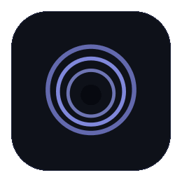
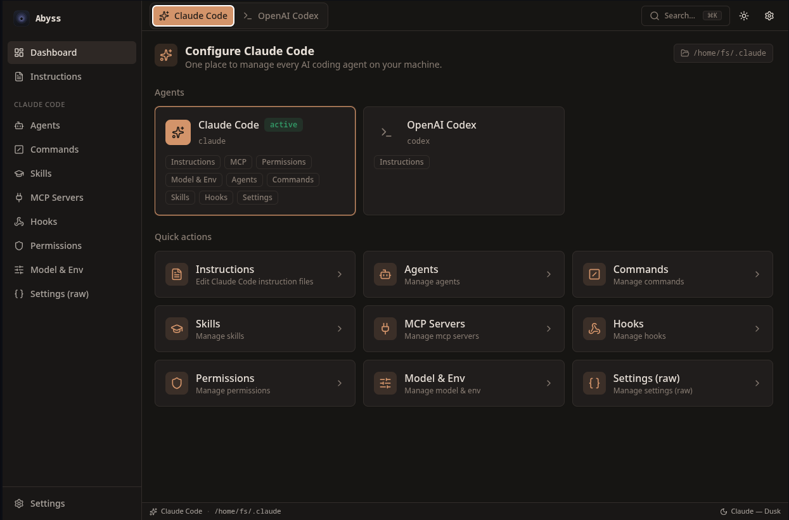
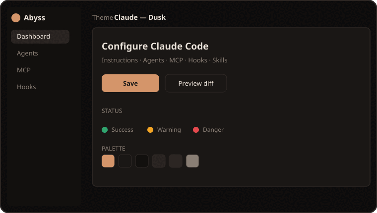

<div align="center">



# Abyss

**One UI to configure every AI coding agent on your machine.**

Abyss is a cross-platform desktop app that reads and writes the *real* config of
Claude Code, OpenAI Codex and more — instructions, MCP servers, hooks, agents,
skills, permissions and themes — through one fast, agent-aware interface.

[](LICENSE)


</div>

---

## Why Abyss?

AI coding agents keep their settings in a scatter of dotfiles and JSON: a
`CLAUDE.md` here, a `settings.json` there, MCP servers buried in `~/.claude.json`,
subagents as loose markdown, hooks nested inside a config blob. Editing them by
hand is fiddly and error-prone.

**Abyss is a single, themed control panel for all of it.** It auto-detects where
each agent stores its config, edits the actual files (with a diff preview and
atomic, non-destructive writes), and adapts the whole UI to whichever agent you
have selected.

<div align="center">
  
  <br />
  <em>The dashboard — every Claude Code surface, one click away.</em>
</div>

---

## Themes

Abyss ships light + dark and a set of per-agent palettes — and a **no-code Theme
Builder** so you can craft your own. Switching the active agent re-themes the
entire app instantly.

<div align="center">
  
</div>

---

## Features

### 🧭 Multi-agent, agent-aware

- Switch the active agent from the top bar — the sidebar, status bar and theme
  all follow it.
- Each surface is **capability-gated**: agents only show the sections they
  actually support.

### 🤖 Full Claude Code surface

- **Instructions** — edit `CLAUDE.md` in a syntax-highlighted editor.
- **Agents / Commands / Skills** — full CRUD over your markdown collections
  (`agents/*.md`, `commands/*.md`, `skills/<name>/SKILL.md`), with frontmatter
  scaffolding for new items.
- **MCP servers** — **auto-detected** from `~/.claude.json`; add / edit / remove
  / toggle without touching the rest of the file.
- **Hooks** — a structured editor for `settings.json` hooks (PreToolUse,
  PostToolUse, Stop, …) with matcher + command.
- **Permissions** — allow / ask / deny rule lists.
- **Model & Env** — default model and environment variables.
- **Settings (raw)** — direct JSON editor for `settings.json` /
  `settings.local.json` with validation, for anything without a dedicated UI.

### 🎨 Theming

- Light & dark, plus per-agent color palettes.
- A **Theme Builder** with live preview and native color pickers — build and save
  your own themes, no code required.

### 🛟 Safe by design

- **Diff preview** before saving real files (toggleable).
- **Atomic writes** (temp file + rename) — a crash can't leave a half-written
  config.
- Edits to big shared files like `~/.claude.json` **preserve every other key**
  (projects, account, caches) and unknown fields.

### ⌨️ Power-user touches

- **Cmd/Ctrl+K** command palette to jump to any agent, page or theme.
- A companion **`abyss` CLI** (`detect` / `export` / `apply`) that shares the
  exact same core logic as the app.

---

## Supported agents

| Agent | Status | Surfaces |
| --- | --- | --- |
| **Claude Code** | ✅ Full | Instructions, Agents, Commands, Skills, MCP, Hooks, Permissions, Model & Env, Raw settings |
| **OpenAI Codex** | ✅ Basic | Instructions (`AGENTS.md`) |
| **Gemini CLI** | 🧩 Example | Ships as the worked example for *“add an agent”* (one line to enable) |

> Adding another agent is intentionally tiny — see
> [Extending Abyss](#extending-abyss).

---

## Install

### Linux — AppImage (recommended)

Grab `Abyss-<version>-x86_64.AppImage` from
[Releases](https://github.com/Fxbixn03/Abyss/releases) (published by CI on
tagged builds), then:

```bash
chmod +x Abyss-*-x86_64.AppImage
./Abyss-*-x86_64.AppImage
```

If you hit a FUSE error, run it extracted:

```bash
./Abyss-*-x86_64.AppImage --appimage-extract-and-run
```

#### Add it to your application menu (KDE/GNOME)

```bash
mkdir -p ~/Applications ~/.local/share/applications
cp Abyss-*-x86_64.AppImage ~/Applications/Abyss.AppImage
chmod +x ~/Applications/Abyss.AppImage

cat > ~/.local/share/applications/abyss.desktop <<EOF
[Desktop Entry]
Type=Application
Name=Abyss
Comment=Unified configuration UI for AI coding agents
Exec=$HOME/Applications/Abyss.AppImage %U
Icon=abyss
Terminal=false
Categories=Development;
StartupWMClass=Abyss
EOF

update-desktop-database ~/.local/share/applications 2>/dev/null || true
```

### Windows

Download the NSIS installer (`Abyss-<version>-x64.exe`) or the portable build
from Releases and run it.

### Build from source

Requires **Node 20+** and **pnpm**.

```bash
git clone https://github.com/Fxbixn03/Abyss.git
cd Abyss
pnpm install

pnpm dev          # run in development (Vite + Electron, hot reload)
pnpm build        # type-check, bundle, and package an installer/AppImage
```

The packaged artifact lands in `release/<version>/`.

---

## First run

On first launch Abyss **auto-detects** each agent's config directory and shows a
quick setup so you can confirm or override the locations. Detected-and-existing
paths get a green check; missing ones a warning; and you can always pick your own
with the folder browser. Your choices are saved — change them any time under
**Settings → Config Paths**.

---

## Usage

- **Switch agents** — use the toggle in the top bar (or Cmd/Ctrl+K → “Switch
  to …”). The UI re-themes instantly.
- **Edit instructions** — open **Instructions**, edit, and **Save**. With diff
  preview on (default) you review the change against the on-disk file first.
- **Manage MCP servers** — **MCP Servers** lists your existing user-scoped
  servers (read from `~/.claude.json`). Add a stdio/http/sse server, edit env,
  or toggle one off.
- **Subagents / commands / skills** — pick **Agents** (or Commands / Skills),
  edit the prompt + frontmatter, or hit **New** to scaffold one.
- **Hooks** — **Hooks** groups your `settings.json` hooks by event; add a
  matcher + command in a couple of clicks.
- **Build a theme** — **Settings → Theme Builder**: tweak colors for light &
  dark, preview live, then *Save & use*.

### Where Abyss reads & writes

Abyss edits your agents' real files — nothing proprietary, nothing hidden:

| Surface | Location |
| --- | --- |
| Claude · Instructions | `~/.claude/CLAUDE.md` |
| Claude · Permissions / Model / Env / Hooks | `~/.claude/settings.json` |
| Claude · MCP servers (user scope) | `~/.claude.json` → `mcpServers` |
| Claude · Agents / Commands / Skills | `~/.claude/{agents,commands,skills}/…` |
| Claude · Raw settings | `~/.claude/settings.json`, `settings.local.json` |
| Codex · Instructions | `~/.codex/AGENTS.md` |
| Abyss · its own preferences | OS userData (`abyss-settings.json`) |

> The two `claude.ai` account connectors (Google Drive, etc.) are managed in your
> Claude account, not a local file, so Abyss surfaces a note rather than pretending
> to edit them.

---

## CLI

The same engine that powers the app is available in your terminal:

```bash
# Show where each agent keeps its config
$ pnpm cli -- detect
Claude Code (claude)
  ✓ /home/you/.claude
  · /home/you/.config/claude
OpenAI Codex (codex)
  · /home/you/.codex
  · /home/you/.config/codex

# Export a portable bundle of your config (instructions, MCP, permissions)
$ pnpm cli -- export --out abyss-bundle.json

# Preview what applying a bundle would change — without writing
$ pnpm cli -- apply abyss-bundle.json --dry-run
```

After packaging, the binary is exposed as `abyss` (`abyss detect`, …).

---

## Demos to record

The animated logo and theme reel above are generated procedurally (see
[Brand assets](#brand-assets)). Short screen recordings of real usage make the
best feature demos — here's a quick storyboard. Record with
[`wf-recorder`](https://github.com/ammen99/wf-recorder) + `gifski` (Wayland) or
[Peek](https://github.com/phw/peek), drop the file in `assets/`, then uncomment
the matching line.

| File | What to show |
| --- | --- |
| `assets/demo-switch.gif` | Toggle Claude ↔ Codex; the whole UI re-themes |
| `assets/demo-mcp.gif` | Open MCP Servers → your real servers appear → add one |
| `assets/demo-instructions.gif` | Edit `CLAUDE.md`, hit Save, review the diff dialog |
| `assets/demo-theme-builder.gif` | Build a theme with the color pickers + live preview |

<details>
<summary>Record a GIF on Wayland (example)</summary>

```bash
wf-recorder -g "$(slurp)" -f /tmp/demo.mp4        # select a region, ⌃C to stop
ffmpeg -i /tmp/demo.mp4 -vf "fps=18,scale=820:-1" -f yuv4mpegpipe - \
  | gifski -o assets/demo-switch.gif -
```

</details>

---

## Architecture & extensibility

Abyss is built feature-first with a strict, typed boundary between the renderer
and the OS:

- **Renderer (React 19 + TS)** never touches `fs`/`path`/`os` — all disk work
  goes through a single **typed IPC** bridge.
- **Core (`core/`)** holds the framework-agnostic config IO and is reused by both
  the Electron main process and the CLI.
- **Theming** is driven entirely by CSS variables, so themes switch with no
  reload and components never hard-code colors.

See [CLAUDE.md](CLAUDE.md) for the full architecture and contributor rules.

### Extending Abyss

**Add an agent** — three small steps, no plumbing:

1. Add an `AgentDefinition` (id, paths, config files) to
   `src/shared/agents/defs.ts`.
2. Create one adapter in `src/features/agents/adapters/<id>.adapter.ts` and
   register it.
3. Add a theme preset in `src/features/themes/presets/`.

The switcher, sidebar, command palette, detection (app + CLI) and theming all
pick it up automatically. (Gemini ships as the worked example.)

**Add an IPC channel / theme** — see the step-by-step recipes in
[CLAUDE.md](CLAUDE.md).

---

## Development

```bash
pnpm dev          # Vite + Electron, hot reload
pnpm build        # type-check → bundle → package
pnpm build:dir    # unpacked build (faster, no installer)
pnpm typecheck    # both TS projects
pnpm lint         # ESLint (zero warnings)
pnpm format       # Prettier
pnpm cli -- ...   # run the abyss CLI in dev
```

```text
core/        Node-only config IO (reused by main + CLI)
electron/    Main process: window, security, typed IPC handlers
cli/         The `abyss` CLI
src/
  shared/    Types, typed IPC client, agent definitions, UI primitives
  features/  Feature-first: agents, config, mcp, hooks, themes, settings, …
  app/       Shell: router, layout (sidebar + top bar + status bar), Cmd+K
```

### Brand assets

The logo and theme GIFs are reproducible:

```bash
python3 scripts/gen-logo-gif.py     # -> assets/abyss-logo.gif
python3 scripts/gen-themes-gif.py   # -> assets/abyss-themes.gif
```

(Requires `rsvg-convert` and ImageMagick.)

---

## Roadmap

- [ ] Project-scoped config (per-project MCP, `.mcp.json`, scope tabs)
- [ ] Profiles (switch between named config sets)
- [ ] More agents (Gemini CLI on by default, others)
- [ ] Auto-update via GitHub Releases
- [ ] Custom theme import/export

---

## Contributing

Issues and PRs are welcome. Please keep the project's invariants intact:
typed IPC only, no Node in the renderer, CSS-variable theming, and a clean
`pnpm lint` + `pnpm typecheck`. See [CLAUDE.md](CLAUDE.md).

## License

[MIT](LICENSE) © 2026 Fxbixn03
