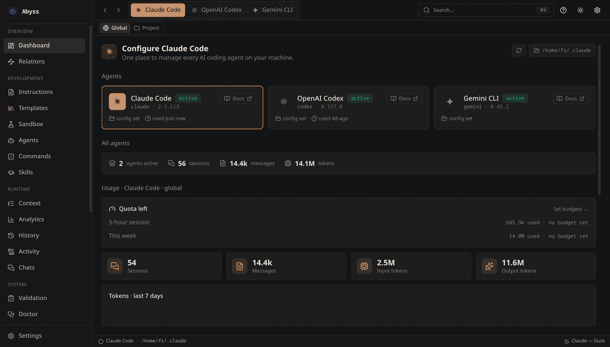

<div align="center">


# Abyss

**One UI to configure every AI coding agent on your machine.**

Abyss is a cross-platform desktop app that turns the scattered dotfiles and JSON
behind Claude Code, OpenAI Codex and more into one calm, themed control panel —
so you can spend your time using your agents, not wrangling their config.

[](LICENSE)


</div>

<div align="center">
  
  <br />
  <em>The dashboard — every surface of your agent, one click away.</em>
</div>

---

## Why Abyss?

AI coding agents keep their settings in a scatter of dotfiles and JSON: a
`CLAUDE.md` here, a `settings.json` there, MCP servers buried in `~/.claude.json`,
subagents as loose markdown, hooks nested inside a config blob. Editing them by
hand is fiddly and easy to get wrong.

Abyss is a single, themed home for all of it. It auto-detects where each agent
stores its config, edits the *actual* files — with a diff preview and atomic,
non-destructive writes — and re-skins the whole UI around whichever agent you've
selected. Nothing proprietary, nothing locked in: the files stay yours, and any
other tool can still read them.

## What you can do

- 🎛️ **Configure everything in one place** — instructions, MCP servers, hooks,
  subagents, commands, skills, permissions, model and env — each with a purpose-
  built editor instead of raw JSON.
- 🔀 **Switch agents in a click** — the sidebar, status bar and theme follow, and
  every surface is capability-aware, so you only ever see what an agent supports.
- 🎨 **Make it yours** — light and dark plus per-agent palettes, and a no-code
  Theme Builder with live preview for rolling your own. Theme switches apply with
  no reload.
- 🛟 **Edit with confidence** — review a diff before anything is written, with
  atomic saves that never leave a half-written config, and shared files like
  `~/.claude.json` keep every key Abyss didn't touch.
- ⚡ **Move fast** — a Cmd/Ctrl+K command palette jumps to any agent, page or
  theme, and a companion `abyss` CLI shares the exact same engine as the app.

<div align="center">
  
  <br />
  <em>Switch the active agent and the whole app re-themes instantly.</em>
</div>

## Supported agents

| Agent | Status | Surfaces |
| --- | --- | --- |
| **Claude Code** | Full | Instructions, Agents, Commands, Skills, MCP, Hooks, Permissions, Model & Env, Raw settings |
| **OpenAI Codex** | Basic | Instructions (`AGENTS.md`) |
| **Gemini CLI** | Example | Ships as the worked example for "add an agent" (one line to enable) |

> Adding another agent is intentionally tiny — see
> [the architecture guide](docs/architecture.md#extending-abyss).

---

## Get Abyss

Grab the latest build for your platform from
**[Releases](https://github.com/Fxbixn03/Abyss/releases)**:

- **Linux** — `Abyss-<version>-x86_64.AppImage`
- **Windows** — the NSIS installer or portable build

```bash
# Linux
chmod +x Abyss-*-x86_64.AppImage
./Abyss-*-x86_64.AppImage
```

For application-menu integration, building from source, and the first-run setup,
see the **[Installation guide](docs/installation.md)**.

## Documentation

| Guide | What's inside |
| --- | --- |
| [Installation](docs/installation.md) | Download, build from source, first run |
| [Usage](docs/usage.md) | Working through each surface, where Abyss reads & writes, the `abyss` CLI |
| [Architecture](docs/architecture.md) | How Abyss is built, extending it, development commands |
| [CLAUDE.md](CLAUDE.md) | The full architecture deep-dive and contributor rules |
| [Contributing](CONTRIBUTING.md) | Workflow, invariants, and how to get a change merged |

---

## Roadmap

- [ ] Project-scoped config (per-project MCP, `.mcp.json`, scope tabs)
- [ ] Profiles (switch between named config sets)
- [ ] More agents (Gemini CLI on by default, others)
- [ ] Auto-update via GitHub Releases
- [ ] Custom theme import/export

## Contributing

Issues and PRs are welcome. Please keep the project's invariants intact: typed
IPC only, no Node in the renderer, CSS-variable theming, and a clean
`pnpm lint` + `pnpm typecheck`. See [CONTRIBUTING.md](CONTRIBUTING.md) for the
full workflow and [CLAUDE.md](CLAUDE.md) for the architecture deep-dive.

## License

[MIT](LICENSE) © 2026 Fxbixn03
