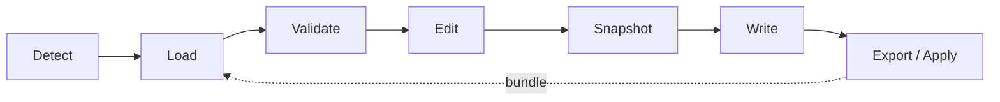

# Agent lifecycle

How a single agent moves from "found on disk" to "config applied", and which
[core modules](Core-Modules.md) and CLI commands drive each step. See also the
[Architecture overview](Architecture.md) and the [docs index](README.md).

## The stages

### 1. Detect

An agent is described by an `AgentDefinition`
([`src/shared/agents/defs.ts`](../src/shared/agents/defs.ts)) and registered in
the agent registry. On disk, `core/agent-detect.ts` decides whether its CLI is
installed and `core/agent-paths.ts` (`detectAgentPaths`, `effectiveBasePath`)
finds where its config lives. From the terminal this is the `abyss detect`
command.

### 2. Load

For the active agent and scope (global vs. a project directory), Abyss reads the
relevant surfaces: instruction files via `core/config-io.ts`, permissions/model/
env via `core/claude-settings.ts`, MCP servers via `core/mcp.ts`, hooks via
`core/hooks.ts`. The renderer triggers these through the typed IPC bridge — it
never reads disk itself (see [Architecture](Architecture.md)).

### 3. Validate

`core/validation.ts` (`runValidation`) lints the loaded config and
`core/doctor.ts` (`runDoctor`) runs a deeper health scan — risky permissions,
broken MCP/hook wiring, oversized context. The Validation and Doctor pages
surface these; `applyDoctorFix` can apply suggested repairs.

### 4. Edit & 5. Snapshot

Edits happen in the feature pages. Every write goes through one atomic
chokepoint that first calls `recordSnapshot` (`core/snapshots.ts`), so the
previous content of any file Abyss overwrites is preserved and listed on the
History page (`listSnapshots` / `restoreSnapshot` / `deleteSnapshot`).

### 6. Write

The actual write lands in the agent's real files (`writeAgentConfigFile`,
`writePermissions`, `writeMcpServers`, …), guarded by `core/path-scope.ts` so a
write can't escape the agent's allowed roots.

### 7. Export / Apply

A whole setup can be captured as a portable bundle with `exportBundle`
(`core/bundle.ts`, secrets redacted via `bundle-redact.ts`) and reproduced
elsewhere with `applyBundle`. From the terminal these are the `abyss export` and
`abyss apply` commands; `profiles.ts` offers the same idea as named, switchable
sets, and a scheduled `runScheduledBackup` (`core/backup.ts`) keeps automatic
copies.

## CLI ↔ GUI parity

| Stage | GUI surface | CLI command | Core module |
| --- | --- | --- | --- |
| Detect | Dashboard | `abyss detect` | `agent-paths.ts` |
| Validate | Validation / Doctor | — | `validation.ts`, `doctor.ts` |
| Snapshot | History | — | `snapshots.ts` |
| Export | Bundles | `abyss export` | `bundle.ts` |
| Apply | Bundles / Profiles | `abyss apply` | `bundle.ts`, `profiles.ts` |

Because both the GUI and the CLI import the same `core/`, the two stay in lock
step automatically — the boundary that makes this work is described in the
[Architecture overview](Architecture.md).
