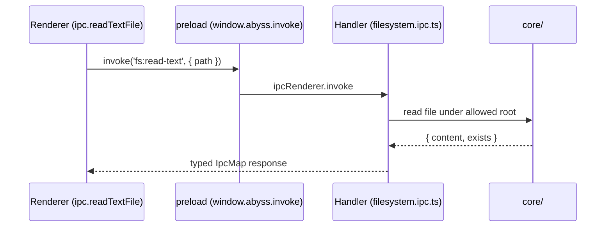

# Architecture overview

A map of the top-level module boundaries in Abyss and how a request flows from
a click in the UI down to a config file on disk. For the contributor rules that
back these boundaries, see [CLAUDE.md](../CLAUDE.md); for the high-level
extensibility guide, see [architecture.md](architecture.md). Related pages:
[Core modules](Core-Modules.md) · [Agent lifecycle](Agent-Lifecycle.md).

## The four layers

Abyss is one Electron app plus a CLI, split into four cooperating layers:

| Layer | Lives in | Responsibility |
| --- | --- | --- |
| **Renderer** | `src/` | React 19 UI. Never imports `fs`/`path`/`os`. Talks to the OS only through the typed IPC client. |
| **Main process** | `electron/` | Owns the window, security (CSP), lifecycle, and one typed IPC handler group per domain. |
| **Core** | `core/` | Framework-agnostic config IO (read/write the agents' real files). Reused by main **and** the CLI. |
| **CLI** | `cli/` | The `abyss` command (`detect` / `export` / `apply`). Imports `core/` directly — no Electron. |

```mermaid
flowchart TD
  subgraph Renderer [src/ — React renderer]
    UI[Feature pages & stores]
    Client[ipc.client.ts — typed wrappers]
    UI --> Client
  end
  subgraph Main [electron/ — main process]
    Preload[preload.ts — window.abyss.invoke]
    Handlers[ipc/*.ipc.ts — handle&#40;IpcChannel.X&#41;]
    Preload --> Handlers
  end
  Core[core/ — config IO]
  CLI[cli/index.ts — abyss CLI]
  Disk[(Agent config files on disk)]

  Client -->|IpcChannel + payload| Preload
  Handlers --> Core
  CLI --> Core
  Core --> Disk
```

The renderer's tsconfig only exposes `vite/client` types, so a stray `import
'fs'` won't even type-check there — the boundary is enforced by the compiler,
not by convention.

## The typed IPC bridge

Every renderer↔main call goes through one bridge, defined in
[`src/shared/types/ipc.ts`](../src/shared/types/ipc.ts):

- `IpcChannel` — an enum of every channel name (e.g. `fs:read-text`).
- `IpcMap` — maps each channel to its `{ request; response }` shape.

The renderer calls `ipc.*` wrappers from
[`src/shared/ipc/ipc.client.ts`](../src/shared/ipc/ipc.client.ts); the main
process registers `handle(IpcChannel.X, …)` in a
[`electron/ipc/*.ipc.ts`](../electron/ipc) group. Because both sides are driven
by `IpcMap`, the compiler guarantees request and response shapes line up
end to end. Raw `ipcRenderer` is never used and untyped channels are never
added.

## Feature-first renderer

Each UI area is self-contained under `src/features/<name>/`
(`adapters/`, `components/`, `hooks/`, `store/`, `pages/`). Cross-feature
helpers live in `src/shared/`. Agents implement an `AgentAdapter`; the registry
in `src/features/agents/registry` is the only place that knows which agents
exist — see [Agent lifecycle](Agent-Lifecycle.md).

## CLI entry point

[`cli/index.ts`](../cli/index.ts) is a thin command layer over `core/`. Because
both the Electron main process and the CLI import the same `core/` functions,
any config logic added there is instantly available to the GUI and the
terminal. See [Core modules](Core-Modules.md) for the catalog.
